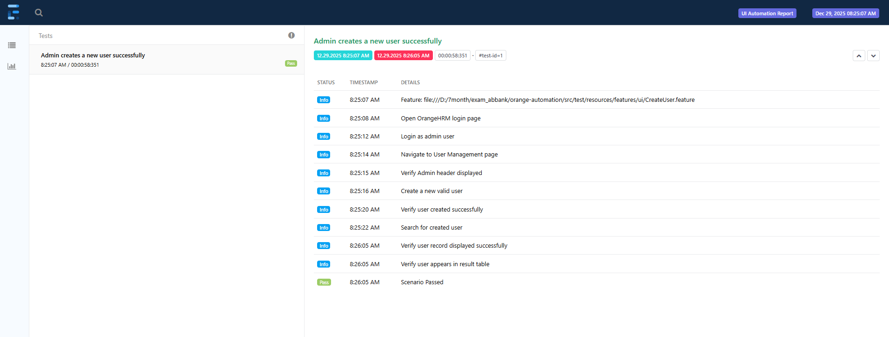
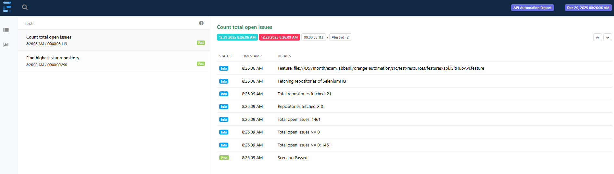

# Test HRM UI - GitHub API Automation

This project contains **UI and API automation tests** for:

- **OrangeHRM** (UI automation)
- **GitHub REST API** (API automation for SeleniumHQ repositories)

Implemented using **Java, Maven, Selenium, RestAssured, Cucumber (BDD)**, and **ExtentReport** for reporting.

---

## **Setup Instructions**

1. **Install Java**
    - Java 17 recommended: [Download Java](https://www.oracle.com/java/technologies/downloads/)

2. **Install Maven**
    - [Install Maven](https://maven.apache.org/install.html)

3. **ChromeDriver**
    - Download ChromeDriver compatible with your Chrome version: [ChromeDriver](https://chromedriver.chromium.org/downloads)
    - Add ChromeDriver to your system PATH

4. **Clone the repository**
```bash
git clone https://github.com/nonghaitan/test_hrm.git
cd orange-automation
```

5. **Install dependencies**
```bash
mvn clean install
```

## **How to Run Test**
1. **Run UI Tests Only**
```bash
mvn clean test -Dtest=UITestRunner
```
   - Report generated in target/extent-report/UI-Report.html
   - 

2. **Run API Tests Only**
```bash
mvn clean test -Dtest=UITestRunner
```
   - Report generated in target/extent-report/API-Report.html
   - 

3. **Run All Tests (UI+API)**
```bash
mvn clean test
```
   - Report generated in target/extent-report/

## **Test execution results**
   - Please check report in target/extent-report/
